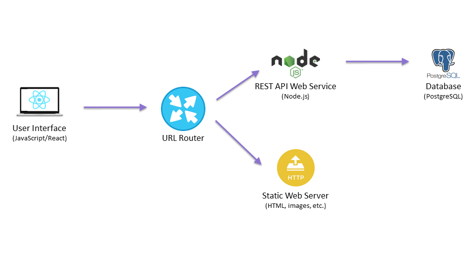

# Step 0: MovieDB App Overview

<!-- START doctoc generated TOC please keep comment here to allow auto update -->
<!-- DON'T EDIT THIS SECTION, INSTEAD RE-RUN doctoc TO UPDATE -->
## Table of Contents

- [A Complete MovieDB App Deployment](#a-complete-moviedb-app-deployment)
- [Next Step](#next-step)

<!-- END doctoc generated TOC please keep comment here to allow auto update -->

## A Complete MovieDB App Deployment

In this guide, we'll be deploying a complete end-to-end app onto a Kubernetes cluster on your local system.
It's a simple app with a React-based user interface that lets you search for movies.

The app consists of:
* A React user interface (built with [create-react-app](https://facebook.github.io/create-react-app/docs/getting-started))
* A static web server to serve the built HTML, CSS, and other static content for the user interface
* A Node.js REST API back end that allows searching for movies
* A Postgres database to store the movie data, automatically populated with test data
* A URL router that routes requests for `/api` to the Node.js API and all other requests to the static web server

## Next Step

Next, we'll install Adapt.

| [<< What is Adapt?](./index.md#what-is-adapt) | [Step 1: Install Adapt >>](./01_install.md) |
| --- | --- |
