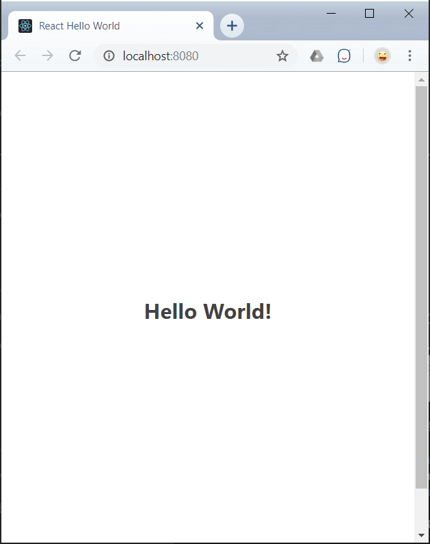

# Step 2: Create and Run - Hello World App

<!-- START doctoc generated TOC please keep comment here to allow auto update -->
<!-- DON'T EDIT THIS SECTION, INSTEAD RE-RUN doctoc TO UPDATE -->
## Table of Contents

- [Create a project](#create-a-project)
- [Small Detour: Set up Kubernetes](#small-detour-set-up-kubernetes)
- [Run!](#run)
- [Test the Hello World App](#test-the-hello-world-app)
- [Next Step](#next-step)

<!-- END doctoc generated TOC please keep comment here to allow auto update -->

## Create a project

We'll base our movie database off of an Adapt starter template called `hello-react-node-postgres`:

```
adapt new hello-react-node-postgres ./moviedb

cd moviedb/deploy
```

This command creates a complete template for a "Hello World" app in a new directory, `moviedb`, then changes into the newly created `moviedb/deploy` directory.

Our new Hello World app consists of:

- A simple React user interface, created with [create-react-app](https://reactjs.org/docs/create-a-new-react-app.html#create-react-app), that displays "Hello World!".
Source code for the UI is in the `moviedb/src` and `moviedb/public` directories.
- A simple Node.js back end API server that responds to HTTP requests with "Hello World!".
Source code for the API server is in the `moviedb/backend` directory.
- A static web server that serves the app's HTML, CSS, JS, and image files.
- A URL router that directs HTTP requests that start with `/api/` to the Node.js back end and all other requests to the static web server.
- A Postgres database (which will be useful in a later step).

## Small Detour: Set up Kubernetes

The Hello World project we created comes ready to deploy, but we need somewhere to deploy it.

> **Tip**
>
> Adapt can deploy your apps to many different kinds of infrastructure, whether in a public or private cloud, in your own data center, or even to your laptop.

For this guide, we're going to deploy to Kubernetes, so we'll create a Kubernetes cluster on your local Docker system using [k3s](https://k3s.io), a lightweight version of Kubernetes.
In order to keep everything self-contained and easy to clean up, we'll use a Docker-in-Docker version of k3s.

To deploy the local cluster and get the credentials:

```
docker run --rm --privileged -d -p10001:2375 -p8443:8443 -p8080:8080 --name k3s unboundedsystems/k3s-dind

docker exec -it k3s get-kubeconfig.sh -json > kubeconfig.json
```

You now have a self-contained Docker-in-Docker Kubernetes cluster that exposes three ports, making them available on the host system:
* Port 10001: Inner Docker instance API
* Port 8443: Kubernetes API
* Port 8080: Our new app's web port

To make sure all the rest of the steps in this guide use the new Docker-in-Docker instance we just created, we need to change your `DOCKER_HOST` environment variable.
We'll also save the old value, so we can set it back after we're done.
```
ORIG_DOCKER_HOST="${DOCKER_HOST}"
export DOCKER_HOST=localhost:10001
```

## Run!
Now, let's run a new deployment of the Hello World app in your newly created local Kubernetes cluster:
```
adapt run --deployID movieapp
```
The `deployID` option gives the newly created deployment a name that we can refer to for later commands.
When the deployment is complete and Adapt has verified that all containers are in the ready state, you should see:

```
Deployment created successfully. DeployID is: movieapp
```

## Test the Hello World App

The app should now be available at: [http://localhost:8080](http://localhost:8080)

If you open this URL in your browser, you should see something like this:



## Next Step

Next, we'll add some code to the Hello World template to turn it into a MovieDB app.

| [<< Step 1: Install Adapt](./01_install.md) | [Step 3: Add Code and Update - MovieDB App >>](./03_update.md) |
| --- | --- |
